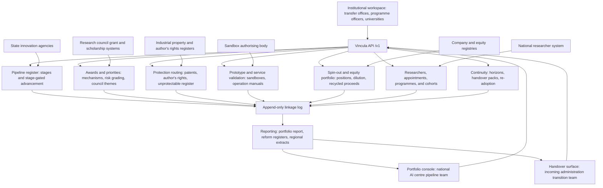

# Vincula

**Source:** `ai-in-gov/Towards-an-ai-strategy-in-Mexico/`
**Domain:** `ai-gov`
**One-liner:** Vincula is the linkage ledger that carries publicly funded AI research from laboratory to market and tracks the people who move with it — stage by stage, with a protection route for inventions the patent law will not cover, an equity position in every spin-out the state seeds, and a handover record that survives a change of administration.
**Wedge:** The technology transfer and pipeline function of a national AI research centre and the research council that funds it, starting with the roughly 144 ai-related projects the national science council has already backed and the 141 researchers in the national researcher system who actually specialise in AI.
**Positioning:** A research-to-commercialisation and talent pipeline system for a country whose problem is not research quality but the missing middle. The source report is explicit that Mexico's starting position differs from the United Kingdom, the United States or Canada: "there is not the same historic investment in connecting academic research and industry or as many examples of multi-million companies based largely on commercialising intellectual property." Vincula is built for that gap — and for the specific obstacles the report documents, from an intellectual property law under which AI programmes cannot be patented at all, to a researcher classification system with no place for computer science, to an election that arrives in the middle of the plan.

## Market research synthesis

### Thesis from source

The white paper, published in June 2018 by Oxford Insights and C Minds, commissioned by the British Embassy in Mexico and funded by the UK Prosperity Fund, argues that Mexico should act now and become one of the first ten countries in the world to deliver a national AI strategy. Its evidence base is a six-week research period comprising qualitative analysis of interviews with more than sixty AI experts across government, large technology companies, startups, academia and non-governmental organisations, a review of existing national strategies, and a quantitative analysis of labour-market impact. That analysis predicts that 19% of all jobs in Mexico — 9.8 million jobs — will be affected by automation over the next two decades, with the largest impacts in manufacturing and construction, and notes that because those sectors predominantly employ men, automation in Mexico carries a gendered dimension requiring careful management. On the readiness side, the report places Mexico 22nd of 35 OECD countries in the Government AI Readiness Index, scoring well on digital infrastructure and open data but poorly on tech skills, digitalisation and public sector innovation.

The research base is real but thin, and the report quantifies it. Between 2002 and 2017 the national science and technology council supported 144 projects related to AI, with investment of more than 432 million Mexican pesos; sixteen projects on data mining and big data between 2011 and 2017 account for about 10% of the total invested in AI projects. There are 464 members of the national researcher system working in fields related to AI and big data, of whom 141 specialise in AI, and they are geographically concentrated: 121 are in Mexico City, with the remainder thinning out rapidly across Guanajuato, the State of Mexico, Jalisco and Nuevo León. On the teaching side there is exactly one university postgraduate programme specialising in AI, with another soon to be formed, while computer science programmes are burgeoning and expected to double in number — the report's stated worry being whether any of them will meet international standards. Interviewees consistently named a shortage of Mexicans holding advanced degrees in data science and machine learning as a binding constraint.

The report's diagnosis of why research does not reach the market is unusually mechanical, and it supplies the pipeline shape a product can be built on. Its "from pure research to market" figure runs through four stations, each with its own output and its own measure of impact: academic institutions producing capacity and publications, measured by global rankings and leaderboards; technology transfer offices producing industrial property and rights of author over apps and software, measured against the world intellectual property index; centres for prototypes producing pilots, commercial validation and operation manuals, measured by scalable projects; and finally the market. The obstacles at each station are named. Intellectual property reform is required because under the current Industrial Property Law AI programmes cannot be patented, only physical products can. University spin-outs need support, and the report recommends seeding an angel investment fund for university startups that invests on a commercial basis and retains a share of the company so the fund becomes self-sustaining. Academics should be allowed to hold joint positions in private companies, on the model of researchers who have held both a professorship and a corporate chief scientist role. Sector councils, following an existing private university's model, should bring industry representatives in to set priorities and to frame how a portion of research funding is allocated so that research directly benefits Mexican business. And a proposed government AI fund, aligning requirements, evaluations and grants across the main existing funding mechanisms, is explicitly told to prioritise riskier investments with high rewards, in order "to help avoid the current challenge of funding only those products or services that have already been successful."

Two structural problems frame everything else. The first is institutional: the national researcher system has seven thematic commissions and AI does not fit any of them, so AI work is not evaluated against international standards for computational sciences — the report interviewed a computer scientist formally classified as a linguist — and the academic community argues this directly damages the country's ability to attract and retain top-level talent, on top of professors carrying administrative loads and teaching requirements that push research into second place. The recommendation is a new eighth board to govern computational sciences and AI. The second is political: Mexico faced elections in July 2018, the digital strategy coordination office sat inside the office and administration of the President and could therefore be restructured wholesale, and many interviewees pressed for an independent body precisely to guarantee continuity. The report responds by tagging its own recommendations to administration horizons — publication of the strategy and creation of a steering group under the current administration, design of the AI office's administrative framework during the transition phase, then a national policy, a hundred-day action plan and the standing office under the new administration — and by recommending a civil-society coalition to build a 2030 road map explicitly designed to go beyond government administrations. Its procurement recommendation is shaped the same way, as a portfolio funnel with declared ratios: an open competition generating ideas, fifty proofs of concept, ten pilots, three running services at full scale.

### Buyer & economic model

- Primary buyer: the national AI research centre once established, jointly with the research council that funds it, since the report assigns the centre both the pipeline role and the custody of national training datasets and a data sandbox. Before the centre exists, the buyer is the central department that owns the strategy and its AI office. Universities with active technology transfer offices are the second wave, and state governments running regional innovation agendas the third.
- Users: technology transfer officers in universities and public research centres; research council programme officers who make and monitor awards; the pipeline and portfolio team at the national centre; postgraduate programme directors and scholarship administrators; sector council secretariats; the fund manager holding equity in seeded spin-outs; and the transition team of an incoming administration.
- Budget owner / value metric: the research council's programme administration budget plus the national centre's operating grant, with a self-financing argument attached: the recommended angel fund retains equity, so realised returns and recycled capital are a measurable offset. The primary value metric is conversion — proofs of concept that become pilots, pilots that become running services, inventions that reach a usable protection route, graduates who stay — measured against declared target ratios rather than counted in isolation.
- Competing status quo: project files held separately by each funding mechanism, with no view of what happened after the grant closed; technology transfer offices that record filings but not commercial outcomes; researcher records held under a classification that does not describe the work; postgraduate enrolment counted but destinations unknown; spin-out equity managed on a case-by-case basis with no portfolio position; and a change of administration that resets the record because the plan lived in the outgoing office's own files.

### Domain constraints

- Regulatory / trust / safety: intellectual property is the binding legal constraint, because a purely software invention cannot be routed to a patent under the current framework and must be routed to author's rights, trade secrecy, or left unprotected — and the count of the third category is politically important evidence. Public funding rules govern awards, so eligibility, competitive selection and reporting obligations bind every record. Personal data protection sits with the national access-to-information and data-protection institute, which constrains what the talent ledger may hold about individuals. Where the state takes equity in a spin-out founded by publicly employed researchers, conflict of interest and the terms of joint appointments have to be declared and visible. Regulatory sandbox authorisations under the financial-services framework are time-limited to a maximum of two years, so any sandbox-dependent pilot in the pipeline carries a hard expiry.
- Data sensitivity: the ledger mixes publishable records — awards, filings, programmes, running services — with commercially confidential ones: unfiled inventions, valuation and equity terms, prototype validation results that would prejudice a filing, and prospective industry partnerships. Individual researchers' mobility and joint appointments are personal data. Each record therefore needs its own disclosure state, and the equity ledger needs a stricter one than the rest of the system.
- Change-management realities: an administration change can rename or dissolve the owning office mid-plan, so the pipeline has to be portable and its commitments re-adoptable by an incoming administration rather than inherited by default. Universities are autonomous and will not accept a central system dictating their filing decisions, so Vincula records their decisions and outcomes rather than approving them. Researcher classification is controlled by the national researcher system, not by the pipeline, so the ledger can only record the mismatch and its consequences. Capacity is concentrated in a handful of states, so any national aggregate needs a concentration measure attached or it will describe the capital and call it the country.

## Business requirements

- BR-1: Every publicly funded AI project sits at exactly one pipeline stage — research, invention, prototype, or in-market — with the evidence required by that stage recorded before it can advance, so that progression is earned rather than asserted.
- BR-2: Every invention resolves to a protection route within a stated period; where the route is unavailable because the subject matter is software rather than a physical product, the record is retained as unprotectable with the reason, and the portfolio reports that count as standing evidence for intellectual property reform.
- BR-3: Portfolio cohorts declare target conversion ratios in advance — ideas to proofs of concept, proofs of concept to pilots, pilots to running services — and the portfolio report shows actual against target at every step rather than a total count of activity.
- BR-4: Awards made under any funding mechanism carry a novelty and risk grade and a flag for whether the product or service had already achieved commercial success; the portfolio reports the share of money that went to already-successful propositions, against a declared ceiling.
- BR-5: Where the state seeds a spin-out, the equity position, dilution through follow-on rounds and any realisation are held in a single portfolio position, and recycled proceeds are reported against the fund's self-sustainability target.
- BR-6: Sector councils record the priority themes they set and the share of research funding allocated under that framework, so the claim that research directly benefits domestic business is measurable rather than asserted.
- BR-7: Researchers in the pipeline are recorded with both their formal classification in the national researcher system and their actual field; classification mismatches are counted and reported, together with the evaluation standard applied, because misclassification is a stated cause of talent loss.
- BR-8: Joint appointments between public research posts and private companies are declared with their conflict-of-interest terms, and teaching and administrative load is recorded as a quantity, so research output is interpreted against the time actually available for it.
- BR-9: Postgraduate programmes feeding the pipeline are recorded with a maturity tier and an international-standard assessment, and student cohorts are tracked from enrolment through completion to first destination, with returns from abroad reported separately from domestic recruitment.
- BR-10: Every project, researcher, programme and spin-out is attributed to a state and, where applicable, to that state's innovation agenda, and every national aggregate is published with a geographic concentration measure.
- BR-11: Every commitment in the pipeline carries an administration horizon; at a change of administration a handover pack is issued and each commitment must be explicitly re-adopted, modified or dropped by the incoming administration within a stated window, with anything unaddressed reported as orphaned.
- BR-12: Pilots that depend on a time-limited sandbox authorisation carry its expiry, and the pipeline blocks advancement to in-market status while the authorisation is the only legal basis for operation.

## User stories

Canonical user stories live in sibling [USER_STORIES.md](USER_STORIES.md).

## System design

### Overview

Vincula tracks two things that move together: work as it travels from research to market, and people as they travel through the system that produces it. On the work side, every publicly funded AI project occupies one stage — research, invention, prototype, or in-market — and advances only when the evidence that stage demands has been recorded: publications and capacity at research; a resolved protection route at invention; commercial validation and operation manuals at prototype; a supported, funded service at in-market. Awards attach to projects with a novelty and risk grade and a flag for prior commercial success, and to the sector council priority they were made under, so the portfolio can report what kind of risk the money actually bought.

The invention stage carries the local legal reality rather than a generic filing workflow. A protection routing decision is required for every invention, and an attempt to route software-only subject matter to a patent is refused with the author's rights alternative offered instead; inventions with no available route are retained as unprotectable with the reason, and that count is a first-class output. Where a spin-out is seeded, the equity taken in exchange is held as a portfolio position that follows dilution through follow-on rounds and records realisations and recycled proceeds against the fund's self-sustainability target.

On the people side, researchers carry both their formal classification in the national researcher system and their actual field, so mismatches can be counted; joint appointments with private companies are declared with their conflict terms; and teaching and administrative load is recorded so output is read against available time. Postgraduate programmes carry a maturity tier and an international-standard assessment, and cohorts are followed from enrolment to first destination, with returns from abroad separated from domestic recruitment. Everything is attributed to a state and, where relevant, to that state's innovation agenda, and national aggregates always carry a concentration measure. Across both sides, every commitment carries an administration horizon; at a change of administration a handover pack is issued and each commitment must be explicitly re-adopted, modified or dropped inside a stated window, with the remainder reported as orphaned.

### Actors & boundaries

- Actors: pipeline and portfolio staff at the national centre; technology transfer officers in universities and public research centres; research council programme officers; the fund manager holding spin-out equity; sector council secretariats; postgraduate programme directors and scholarship administrators; state innovation agency staff; and the transition team of an incoming administration.
- Trust boundary: Vincula is the linkage record, not the authority for any of the underlying decisions. It does not grant intellectual property, does not award funding, does not classify researchers in the national system, and does not run the sandbox that authorises a pilot. Universities keep their autonomy over filing decisions and Vincula records the decision, its route and its outcome. What Vincula owns is the connection between them — which award produced which invention, which route it took, which prototype it became, which spin-out holds it, which equity position the state has, and which people were involved.
- Human-in-the-loop points: advancing a project between stages against the stage's evidence; deciding and recording a protection route; grading novelty and risk at award; declaring a joint appointment and its conflict terms; assessing a programme's maturity tier; recording a cohort destination; approving an equity position and any realisation; issuing a handover pack; and re-adopting, modifying or dropping a commitment after an administration change.

### Core capabilities

1. **Pipeline register** — projects held at research, invention, prototype or in-market stages with stage-gated evidence requirements and recorded advancement decisions.
2. **Award and priority linkage** — funding awards across mechanisms, novelty and risk grading, prior-commercial-success flags, and linkage to sector council priority themes and their allocated share.
3. **Protection routing** — invention records, route determination with refusal of unavailable routes, filings for patents and author's rights, and an unprotectable register with reasons.
4. **Prototype and service validation** — prototypes, commercial validation records, operation manuals, sandbox dependencies with expiry, and running services with support and funding status.
5. **Spin-out and equity portfolio** — spin-outs, state equity positions, follow-on rounds and dilution, realisations, and recycled proceeds against the fund's sustainability target.
6. **Researcher and appointment ledger** — researchers with formal classification and actual field, mismatch counting, joint appointments with conflict terms, and teaching and administrative load records.
7. **Talent pipeline** — postgraduate programmes with maturity tier and international-standard assessment, student cohorts from enrolment to first destination, scholarships, and returns from abroad.
8. **Regional attribution** — state and innovation-agenda attribution with geographic concentration measures on every aggregate.
9. **Continuity across administrations** — administration horizons on commitments, handover packs, re-adoption decisions, orphan reporting, and the long-horizon road map items designed to outlive an administration.

### Conceptual data

- Primary entities: `PipelineProject`, `PipelineStage`, `StageAdvancement`, `FundingAward`, `FundingMechanism`, `SectorCouncil`, `PriorityTheme`, `Invention`, `ProtectionRouting`, `ProtectionFiling`, `Prototype`, `CommercialValidation`, `SandboxAuthorisation`, `RunningService`, `PortfolioCohort`, `FunnelTarget`, `SpinOut`, `EquityPosition`, `FollowOnRound`, `Researcher`, `ResearcherClassification`, `JointAppointment`, `WorkloadRecord`, `PostgraduateProgramme`, `StudentCohort`, `Scholarship`, `CohortDestination`, `StateAttribution`, `Commitment`, `AdministrationHorizon`, `HandoverPack`, `ReadoptionDecision`, `PortfolioReport`.
- Critical events: project registered at a stage; stage advancement approved or refused for missing evidence; award made with risk grade and prior-success flag; award linked to a council priority; invention disclosed; protection route determined, refused, or recorded as unavailable; filing lodged, granted or abandoned; prototype validated commercially; operation manual delivered; sandbox authorisation granted and expiring; service entering or leaving operation; cohort opened with funnel targets and closed with actuals; spin-out incorporated; equity position taken, diluted or realised; proceeds recycled; researcher classification mismatch recorded; joint appointment declared; programme tier assessed; cohort destination recorded; return from abroad recorded; administration change; handover pack issued; commitment re-adopted, modified, dropped or left orphaned.
- Retention / audit needs: equity positions and protection filings have legal lives measured in decades, and a spin-out founded from a public award may be litigated or audited long after the pipeline record was closed, so project, invention, filing and equity records are retained for the life of the right plus the statutory limitation period and are append-only. Stage advancements, protection routings, risk gradings and re-adoption decisions are never overwritten, because the question asked at audit is who decided what on which evidence — and because a handover pack is only worth anything if the incoming administration can see the decisions the outgoing one made.

### Integrations (conceptual)

- Systems of record: the research council's grant and scholarship systems as the authority for awards and scholarships; the industrial property authority for patent filings and the author's rights register for software; university technology transfer and human resources systems; the national researcher system for formal classification and level; company and equity registries for spin-outs and rounds; the financial-services sandbox authority for time-limited authorisations; state innovation agency programme records.
- Upstream signals: publication and citation records and conference acceptances behind research-stage evidence; postgraduate enrolment and completion data; scholarship disbursement records; industry partner declarations of interest from sector councils; procurement records for services entering government operation; sandbox authorisation notices and expiries; follow-on financing rounds and valuations; state innovation agenda priority lists.
- Downstream actions: the portfolio report with conversion against declared funnel ratios; the unprotectable-inventions register issued as evidence for intellectual property reform; classification mismatch counts issued in support of a dedicated computational sciences board; equity and recycled-proceeds statements to the fund's overseers; stage-gate refusals returned to project teams with the missing evidence named; handover packs and orphaned-commitment lists at an administration change; and state-level pipeline extracts for regional innovation agencies.

### High-level architecture

Transfer officers, programme officers, programme directors and state staff work in an institutional workspace; the national centre's pipeline team works in a portfolio console; the incoming administration's transition team gets a handover surface. All pass through one API. Behind it, the pipeline service enforces stage gates, the awards service holds funding and priority linkage, the protection service routes inventions and refuses unavailable routes, the validation service holds prototypes and sandbox dependencies, the equity service holds spin-out positions and dilution, the people service holds researchers, appointments, load, programmes and cohorts, and the continuity service holds horizons, handover packs and re-adoption decisions. An append-only linkage log feeds the reporting service, which produces the portfolio report, the reform registers and the regional extracts.

### Success metrics

- Leading: share of projects with complete stage evidence for their current stage; median days from invention disclosure to protection route determined; count of route refusals caught before a filing was attempted; share of awards carrying a novelty and risk grade at decision; share of awards linked to a sector council priority; count of declared joint appointments and share with conflict terms recorded; share of programmes with an international-standard assessment; share of cohorts with a recorded first destination; share of commitments carrying an administration horizon.
- Lagging: cohort conversion against declared funnel ratios at each step, ending in running services delivered at full scale; number of inventions recorded as unprotectable and the reform case they support; share of award money that went to propositions already commercially successful, against the declared ceiling; number of spin-outs incorporated, equity realisations and proceeds recycled against the fund's sustainability target; classification mismatch count and its movement after a dedicated board is created; graduate retention in domestic academia and industry versus departures abroad, and returns from abroad attributable to a named attraction effort; geographic concentration of researchers and projects outside the capital; and commitments re-adopted, modified, dropped or left orphaned at each change of administration.

## OpenAPI skeleton

Canonical HTTP surface lives in sibling `openapi.yaml`. Summarize here:

- **Base path:** `/v1/...`
- **Auth:** `X-API-Key` for university, grant-system and registry integrations; Bearer JWT for named officers whose stage-gate, routing, equity and re-adoption decisions are attributed in the linkage log.
- **Resource groups:** `Pipeline`, `Awards`, `Protection`, `Validation`, `Equity`, `Researchers`, `Talent`, `Regional`, `Continuity`, `Reporting`.
