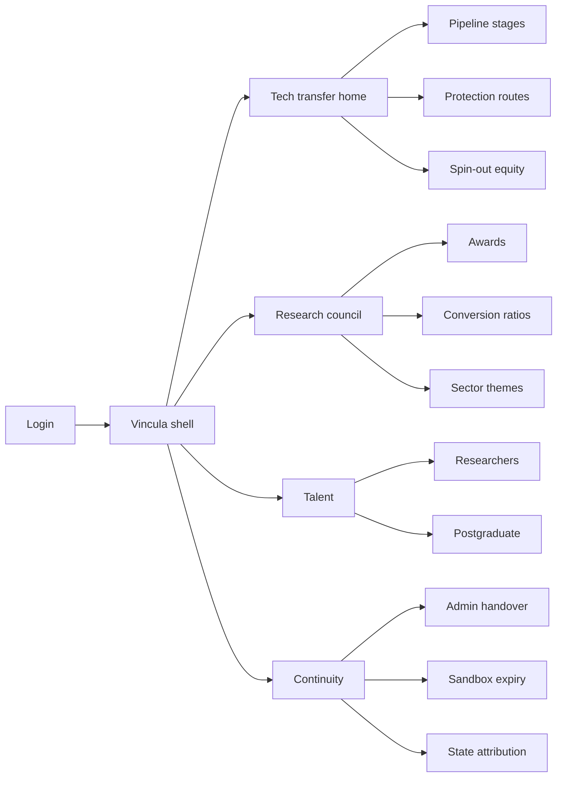
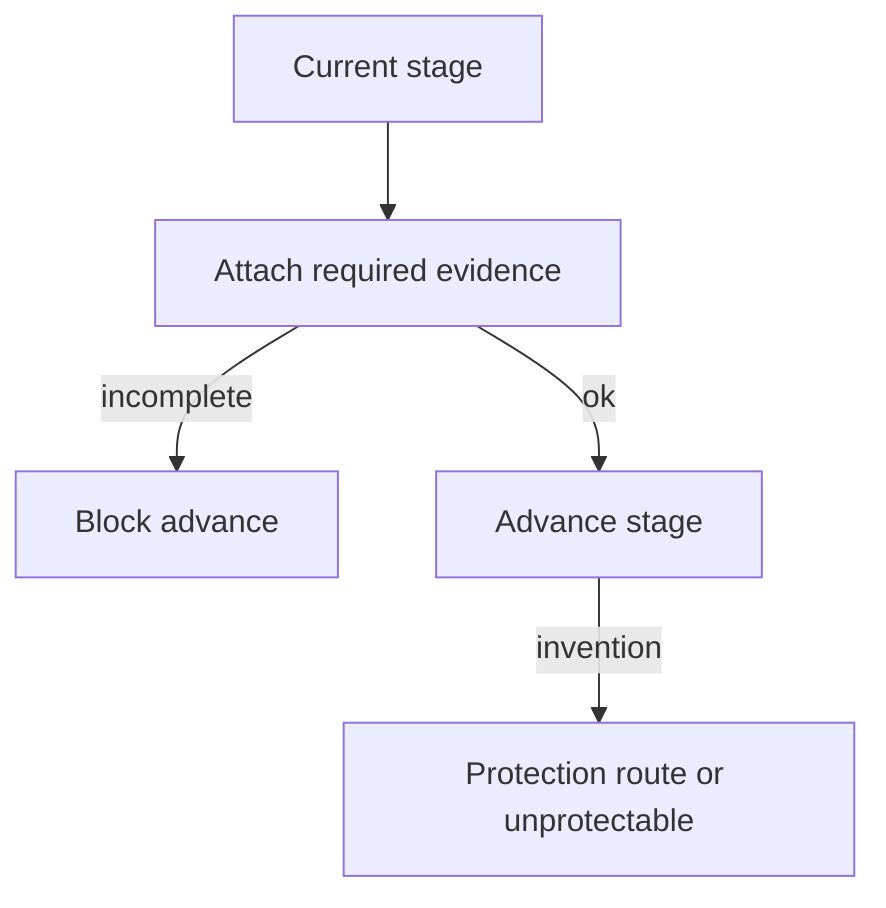
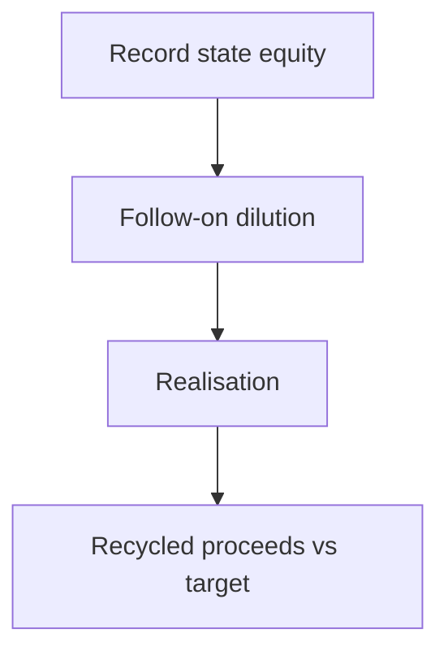

# Vincula — Web app

**Product:** [PRODUCT.md](./PRODUCT.md)
**Primary surface:** Public AI research-to-market linkage ledger (tech-transfer office, research-council, and continuity-admin workspaces under one Vincula shell)
**Secondary surfaces:** Administration handover pack (re-adoption window); public portfolio extract (geographic concentration + conversion ratios)
**Design thesis:** Vincula is a linkage ledger — the vinculum that binds publicly funded AI from lab to market and the people who move with it. The metaphor is a stage-gated chain with seals: research → invention → prototype → in-market, each advance earned with evidence; unprotectable software inventions counted as reform evidence; state equity in spin-outs tracked through dilution; commitments surviving administration change only if explicitly re-adopted. Visual language is volcanic terracotta-ink avoided — instead highland pine green and clay-rose on warm stone (Mexico research gravity without tourism cliché or purple AI). The Vincula wordmark sits as a quiet ligature mark on every stage advance and handover screen.

## UX research synthesis

### Category peers (best-in-class)

- **AUTM / university TTOs and Wellspring-class IP systems:** Invention disclosure → protection → licence/spin-out. Steal: stage evidence before advance; reject assuming patents always available for software AI (BR-2).
- **British Business Bank / public venture portfolio trackers:** Equity position, dilution, realisation, recycled proceeds. Steal: fund self-sustainability reporting; reject vanity deal-count dashboards.
- **CONACYT/SECIHTI-style research information systems (Mexico process peer):** Researcher classification and project registries. Steal: formal vs actual field mismatch reporting (BR-7); reject activity totals without conversion ratios (BR-3).
- **Horizon Europe / grant continuity tools:** Commitment survival across political cycles. Steal: handover and re-adoption windows (BR-11); reject silent orphaning of pilots.

### Patterns to adopt / reject

- **Adopt:** Exactly one pipeline stage with evidence gates; protection-route timer including unprotectable-with-reason; declared conversion-ratio targets vs actual; novelty/risk grades and already-successful funding ceiling; spin-out equity/dilution/realisation; sector-council theme allocation shares; researcher classification mismatch counts; joint-appointment CoI and teaching-load context; postgraduate maturity and destination tracking; state attribution with concentration measure; administration handover re-adoption; sandbox expiry blocking in-market.
- **Reject:** Activity-count theatre; silent stage jumps; ignoring software IP gaps; equity forgotten after seed; purple AI; national totals without geography.

### Trust, density, and workflow constraints from PRODUCT.md

~144 AI projects and ~141 specialised researchers are the wedge starting set. Misclassification drives talent loss (BR-7). Administration changes orphan commitments without handover (BR-11). Sandbox-only legal basis cannot become permanent market (BR-12). Geographic concentration must be published with national aggregates (BR-10).

## Information architecture

### Nav model

### Roles → default home

| Role | Default home | Why |
|------|--------------|-----|
| Tech-transfer officer | Pipeline — stage gates | Earned advancement (BR-1) |
| IP / protection lead | Protection routes | Unprotectable software count (BR-2) |
| Research council portfolio | Awards + conversion ratios | Targets vs actual (BR-3, BR-4) |
| Fund / equity manager | Spin-out positions | Dilution and recycle (BR-5) |
| Talent / SNI liaison | Researchers mismatches | Classification vs field (BR-7) |
| Continuity admin | Handover pack | Re-adoption window (BR-11) |
| State innovation officer | Regional attribution | Concentration honesty (BR-10) |

### Cross-links to OpenAPI resources

| Nav area | OpenAPI tags / resources |
|----------|---------------------------|
| Pipeline stages / advances | Pipeline |
| Funding awards / novelty grades | Awards |
| Protection routes / unprotectable | Protection |
| Conversion ratio targets / actuals | Validation |
| Spin-out equity positions | Equity |
| Researcher classification | Researchers |
| Postgraduate programmes / destinations | Talent |
| State attribution / concentration | Regional |
| Admin handover / sandbox expiry | Continuity |
| Portfolio reports | Reporting |

## Screen inventory

### Tech-transfer home

- **Purpose:** Answer “where is each funded project stuck, and what evidence blocks the next stage?”
- **Entry:** TTO default.
- **Layout regions:** Brand; stage kanban (research/invention/prototype/in-market); blocked advances; sandbox-expiry warnings; orphaned commitments count.
- **Primary actions:** Open project; advance stage; open protection; open handover.
- **Empty / loading / error:** Empty = import council project cohort wizard.
- **BR / story ties:** BR-1, BR-12.

### Pipeline stage detail

- **Purpose:** Exactly one stage; evidence checklist required before advance.
- **Entry:** From kanban.
- **Layout regions:** Stage seal; evidence list; advance control; history of stage entries.
- **Primary actions:** Attach evidence; advance; revert only via recorded exception.
- **Empty / loading / error:** Missing evidence disables advance.
- **BR / story ties:** BR-1.

### Protection route desk

- **Purpose:** Resolve invention to protection route in time; record unprotectable software with reason for reform evidence.
- **Entry:** Invention stage; IP lead.
- **Layout regions:** Route options; timer; unprotectable register; portfolio count of unprotectable.
- **Primary actions:** Select route; mark unprotectable; escalate to policy report.
- **Empty / loading / error:** Timer breach = amber defect on project.
- **BR / story ties:** BR-2.

### Awards and novelty ceiling

- **Purpose:** Novelty/risk grade; flag already-commercially-successful; report share vs declared ceiling.
- **Entry:** Council home.
- **Layout regions:** Award table; grades; already-successful share vs ceiling; mechanism tags.
- **Primary actions:** Record award; flag success; export ceiling breach.
- **Empty / loading / error:** Over ceiling = coral portfolio alert.
- **BR / story ties:** BR-4.

### Conversion ratio board

- **Purpose:** Cohort targets for idea→PoC→pilot→service vs actual at each step.
- **Entry:** Validation nav.
- **Layout regions:** Funnel with target/actual; cohort selector; variance.
- **Primary actions:** Set targets; refresh actuals; brief sector council.
- **Empty / loading / error:** Activity-only total hidden behind toggle with warning.
- **BR / story ties:** BR-3.

### Spin-out equity ledger

- **Purpose:** State seed equity, dilution, realisation, recycled proceeds vs self-sustainability target.
- **Entry:** Equity nav.
- **Layout regions:** Position table; cap-table events; recycle meter; fund target.
- **Primary actions:** Record round; realise; allocate recycle.
- **Empty / loading / error:** Empty = no spin-outs seeded.
- **BR / story ties:** BR-5.

### Sector theme allocation

- **Purpose:** Sector councils’ priority themes and funding share under framework.
- **Entry:** Council; sector view.
- **Layout regions:** Theme list; allocation %; linked projects; domestic-business benefit claim meter.
- **Primary actions:** Set theme; allocate; report share.
- **Empty / loading / error:** Unallocated pool visible.
- **BR / story ties:** BR-6.

### Researcher classification desk

- **Purpose:** Formal national-system class vs actual AI field; mismatch counts; evaluation standard applied.
- **Entry:** Talent home.
- **Layout regions:** Researcher table; mismatch flags; load (teaching/admin); joint-appointment CoI terms.
- **Primary actions:** Correct field; declare joint appointment; export mismatch report.
- **Empty / loading / error:** High mismatch = talent-loss risk banner.
- **BR / story ties:** BR-7, BR-8.

### Postgraduate pipeline

- **Purpose:** Programme maturity tier, international-standard assessment, enrolment→completion→first destination; returns from abroad separate.
- **Entry:** Talent → Postgrad.
- **Layout regions:** Programme cards; cohort funnel; destination split (domestic/abroad return).
- **Primary actions:** Update cohort; record destination; assess maturity.
- **Empty / loading / error:** Empty destinations = incomplete tracking warning.
- **BR / story ties:** BR-9.

### Regional attribution

- **Purpose:** Attribute every entity to a state/innovation agenda; national aggregate with concentration measure.
- **Entry:** Regional nav; public extract.
- **Layout regions:** State map/list; concentration index; agenda links.
- **Primary actions:** Attribute; publish aggregate with concentration.
- **Empty / loading / error:** Missing state blocks national publish.
- **BR / story ties:** BR-10.

### Administration handover

- **Purpose:** Issue handover pack; re-adopt/modify/drop each commitment in window; report orphans.
- **Entry:** Continuity home on administration change.
- **Layout regions:** Commitment list; horizon dates; decision controls; orphan report.
- **Primary actions:** Issue pack; record decision; escalate orphans.
- **Empty / loading / error:** Unaddressed past window = orphan coral list.
- **BR / story ties:** BR-11.

### Sandbox expiry gate

- **Purpose:** Block in-market advancement while sandbox is sole legal basis.
- **Entry:** Pipeline advance to in-market; continuity.
- **Layout regions:** Authorisation expiry; legal-basis checklist; block banner.
- **Primary actions:** Extend sandbox; obtain durable basis; then advance.
- **Empty / loading / error:** Advance attempt while sandbox-only = hard block.
- **BR / story ties:** BR-12.

## Key flows

1. **Earned stage advance** — evidence at stage → protect if invention → advance; failure: missing evidence or unprotectable timer breach flagged.

2. **Spin-out sustainability** — seed equity → dilution events → realisation → recycle vs target.

3. **Administration handover** — pack issued → re-adopt/modify/drop → orphans reported.

4. **Conversion ratio review** — set cohort targets → measure actual funnel → brief council.

5. **Sandbox to market** — check durable legal basis → else block in-market.

## Design system

### Tokens (CSS variables)

- `--color-ink: #1F1A17` — text
- `--color-stone: #EDE6DC` — ground (warm stone, not cream-terracotta cliché pairing)
- `--color-panel: #FFFAF5`
- `--color-pine: #1F5C45` — primary / stage sealed
- `--color-rose: #A65D4E` — attention / orphan / ceiling (clay rose, not terracotta brand flood)
- `--color-gold: #B0892E` — equity / realisation
- `--color-coral: #C4473A` — hard blocks / orphans
- `--color-steel: #6B6560` — secondary
- `--color-brand: #2F6B52` — Vincula ligature
- `--font-display: "Literata", serif` — project and stage titles
- `--font-body: "IBM Plex Sans", sans-serif`
- `--font-mono: "IBM Plex Mono", monospace` — project ids, equity lots, handover ids
- `--space-1`…`--space-8`: 4px scale
- `--radius-sm: 4px`; `--radius-md: 8px`
- `--motion-seal: 170ms ease-out` — stage advance seal
- `--motion-orphan: 220ms ease-in-out` — orphan pulse
- `--motion-block: 160ms ease-out` — sandbox block
- Atmosphere: subtle vinculum/ligature line motifs; paper fiber; no stock folkloric heroes.

### Typography & brand

- Literata for pipeline titles; mono for equity and handover ids.
- Brand on stage advance, equity, and handover screens.
- Login: brand hero; headline (“Lab to market, with the people who move”); one CTA.

### Do / don’t

- **Do:** Gate advances on evidence; count unprotectable inventions; show target vs actual conversion; track equity dilution; re-adopt on admin change; block sandbox-only market entry.
- **Don’t:** Activity-count home; silent stage jumps; assume patents for all AI; purple AI; hide geographic concentration.

### Accessibility & domain trust cues

- Stage colours with text seals.
- Live regions for orphan and sandbox expiry.
- Focus: pipeline → protection → equity → handover.
- Public extract strips confidential CoI detail.

## Component patterns

- **StageKanban** — four stages with evidence locks.
- **AdvanceEvidenceChecklist** — required artefacts per stage.
- **UnprotectableRegister** — software IP gap with reason.
- **ConversionFunnel** — target vs actual cohort ratios.
- **AwardCeilingMeter** — already-successful funding share.
- **EquityPositionLedger** — dilution and recycle.
- **MismatchFlag** — formal class vs actual field.
- **JointAppointmentCoi** — declared terms + load.
- **DestinationSplit** — domestic vs return-from-abroad.
- **ConcentrationIndex** — geographic honesty on aggregates.
- **HandoverDecisionRow** — re-adopt / modify / drop.
- **SandboxBlockBanner** — in-market hard stop.

## Out of scope for v1 web

- Patent prosecution filing systems; full HR for researchers; replacing national researcher-system databases; citizen crowdfunding; multi-country treaty IP; training LMS.
